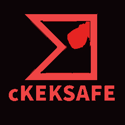

# cKEKSAFE.



**Cheksafe** est une application Python qui automatise la vérification de fichiers pour détecter les malwares en utilisant l'API de VirusTotal. Avec une interface utilisateur conviviale et des thèmes personnalisables, Cheksafe permet aux utilisateurs de sélectionner plusieurs fichiers et d'obtenir des résultats d'analyse clairs et détaillés.

## Fonctionnalités

- **Vérification multiple** : Analysez plusieurs fichiers simultanément.
- **Interface moderne** : Interface CustomTkinter avec mode sombre, mode clair, sidebar et cartes de résultats.
- **Affichage moderne des résultats** : Visualisez les résultats d'analyse directement dans le tableau de bord.
- **Rapport détaillé VirusTotal** : Consultez les hashes, la date d'analyse, le score, le lien VirusTotal et le détail moteur par moteur.
- **Rapports automatiques** : Chaque rapport détaillé est enregistré automatiquement dans le dossier Documents de l'utilisateur (`Documents/cKEKSAFE-Rapports` sur Windows et Linux), avec un bouton pour l'exporter ailleurs.
- **Barre de progression** : Suivez l'avancement des analyses.
- **Logo rouge/noir intégré** : Le logo est utilisé dans l'interface, l'icône de fenêtre, l'exécutable et ce README.

## Prérequis

- Python 3.x
- Bibliothèques Python nécessaires :
  - `requests`
  - `customtkinter`
  - `tkinter`

## Installation

1. Clonez le dépôt ou téléchargez le projet.
2. Installez les dépendances nécessaires avec :
   ```bash
   pip install -r requirements.txt
   ```

## Utilisation

1. Lancez `python cKEKSAFE.py` ou utilisez l'executable disponible dans le dossier `dist`.
2. Entrez votre clé API VirusTotal.
3. Sélectionnez les fichiers à analyser.
4. Cliquez sur "Vérifier" pour lancer l'analyse.

## Build et release

Le workflow GitHub Actions `.github/workflows/release.yml` construit automatiquement :

- `cKEKSAFE-windows.exe` pour Windows.
- `cKEKSAFE_<version>_amd64.deb` pour Debian/Ubuntu.
- `cKEKSAFE-debian-amd64.deb` comme lien direct stable Debian/Ubuntu.
- `cKEKSAFE-<version>-1.x86_64.rpm` pour Fedora.
- `cKEKSAFE-fedora-x86_64.rpm` comme lien direct stable Fedora.
- `cKEKSAFE-linux-x86_64` comme binaire Linux portable.

Pour publier une release avec tous les fichiers visibles dans GitHub :

```bash
git tag v1.0.0
git push origin v1.0.0
```

GitHub Actions va compiler l'app, creer les paquets et les attacher automatiquement a la release `v1.0.0`.
Un lancement manuel depuis l'onglet Actions cree aussi les artefacts, mais seule une execution sur tag cree une vraie release GitHub.

## GitHub Pages

La page publique est dans `index.html`. Le workflow `.github/workflows/pages.yml` la publie automatiquement sur GitHub Pages quand vous poussez sur `main` ou `master`.

La page utilise le logo rouge/noir et propose des telechargements directs pour Windows, Debian/Ubuntu et Fedora.
Au premier deploiement, verifiez dans `Settings > Pages` que la source est reglee sur `GitHub Actions`.

URL prevue de la page :

```text
https://anarchis12.github.io/cKEKSAFE/
```


## Contribution
Les contributions sont les bienvenues ! N'hésitez pas à soumettre des problèmes ou des demandes de fonctionnalités.
